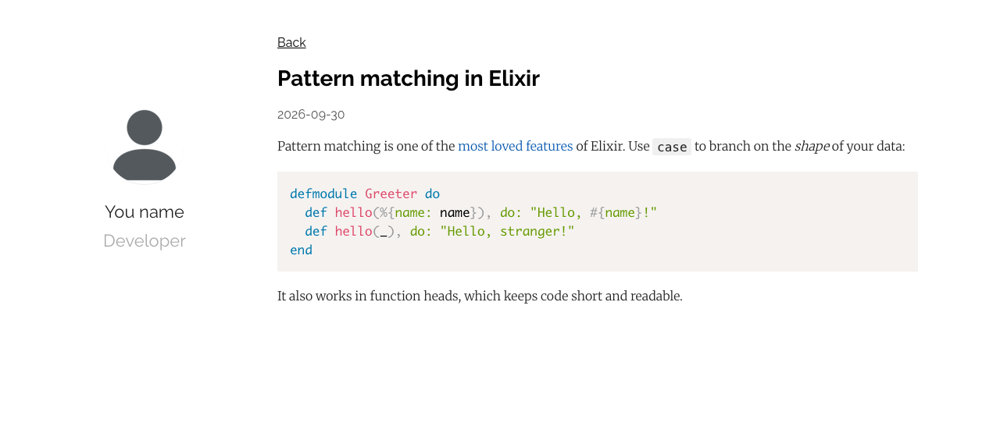
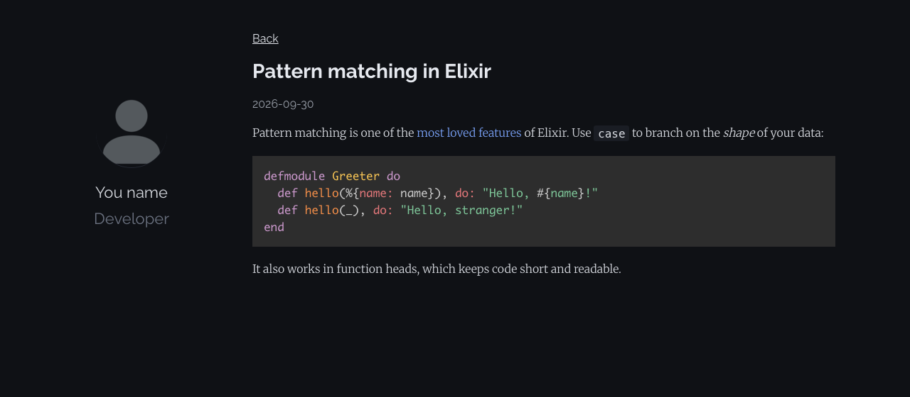
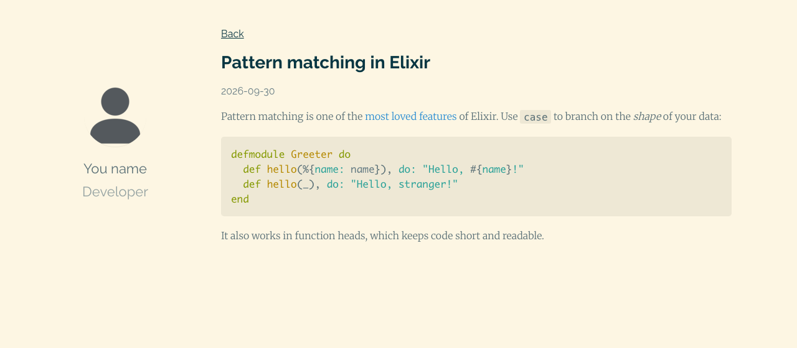
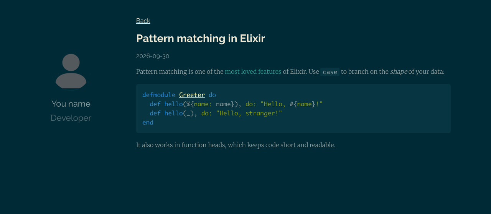
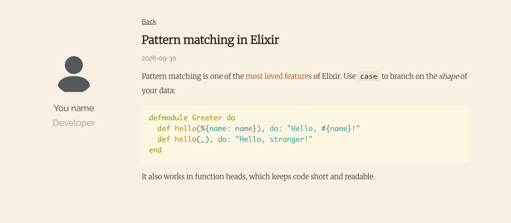
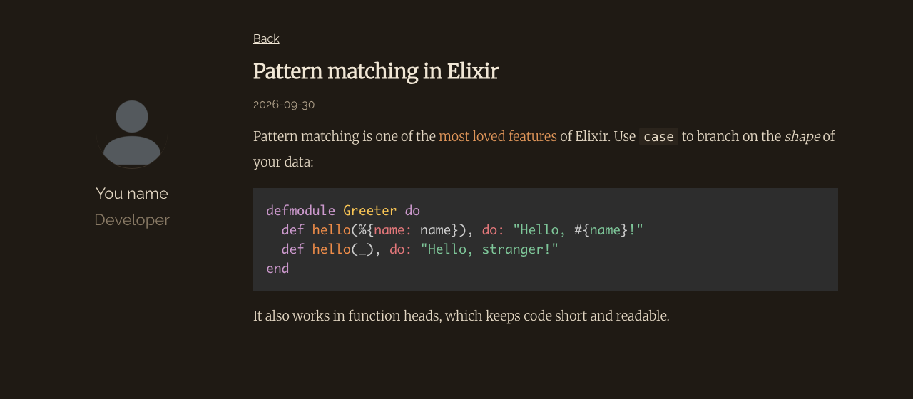

[](https://hexdocs.pm/simple_blog)

# Simple Blog


A blog engine written in elixir to generate static blogs from markdown.

  

## Installation

```elixir

def deps do

[

{:simple_blog, "~> 0.4.0"}

]

end

```

  ## Usage

  

```console

$ git clone git@github.com:viniciusalonso/simple_blog.git

$ cd simple_blog/

$ mix deps.get
```

### Generate new blog post

```console
$ mix simple_blog.gen.post "10 tips for new developers"
```

The file will be created at `blog/_posts/yyyy-mm-dd-10-tips-for-new-developers.md`, using today's date in your local timezone. Accents and punctuation are removed from the filename, so `"Introdução ao Elixir: o básico?"` becomes `yyyy-mm-dd-introducao-ao-elixir-o-basico.md`, while the post keeps the original title. If a post with the same filename already exists, the command stops without changing it.

### Running local server

The local http server is designed to local development of your blog. To start it run the command below:

```console
$ mix clean
$ mix simple_blog.server
```

The server will be running at `http://localhost:4000`. If that port is already in use, pick another one with the `--port` flag:

```console
$ mix simple_blog.server --port 4001
```

### Generate static blog

To generate the static version you should run the command:

```console
$ mix simple_blog.compile
```

The command will generate a directory called `output`. To generate it in a custom path, use the `--output` flag:

```console
$ mix simple_blog.compile --output=/path/to/my_blog
```

## Syntax highlighting

Code blocks in your posts are automatically highlighted using [Prism.js](https://prismjs.com/), loaded via CDN in the post template. Just use fenced code blocks with the language identifier in your markdown:

````markdown
```elixir
defmodule Counter do
  def increment(n), do: n + 1
end
```
````

## Images

Put your images inside the `blog/images/` directory (subdirectories are allowed) and reference them with an absolute path starting with `/images/`:

```markdown

```

The same works for `` tags in your posts and templates:

```html

```

When you run `mix simple_blog.compile`, the whole `blog/images/` directory is copied to `output/images/`. Absolute image paths are rewritten to relative ones, so the generated blog works from any location. For example, `/images/avatar.png` becomes `./images/avatar.png` in `index.html` and `../../../../images/avatar.png` in posts.

Only `src` values that start with a single `/` are rewritten. These are left as they are:

- External URLs, such as `https://example.com/photo.jpg`
- Protocol-relative URLs, such as `//cdn.example.com/photo.jpg`
- Relative paths, such as `images/avatar.png`

The local server (`mix simple_blog.server`) serves any file under `blog/`. The content type comes from the file extension (`image/png`, `image/jpeg`, `image/svg+xml`, `image/gif`, `image/webp`, …). If a file doesn't exist, the server returns `404 Not found`.

## Themes

Pick a theme in `blog/config.exs`:

```elixir
[
  theme: "sepia"
]
```

| Theme       | Description                                                       |
| ----------- | ----------------------------------------------------------------- |
| `light`     | The default, based on [plainwhite](https://github.com/samarsault/plainwhite-jekyll). Always light |
| `dark`      | Always dark, whatever the reader's system preference               |
| `solarized` | The [Solarized](https://ethanschoonover.com/solarized/) palette    |
| `sepia`     | Warm paper tones with larger serif type for long reads            |

`solarized` and `sepia` switch to a dark variant automatically when the reader's system is in dark mode. `light` is always light and `dark` is always dark. Each theme also picks a matching [Prism.js](https://prismjs.com/) style for code blocks.

If `blog/config.exs` doesn't exist, the `light` theme is used. An unknown theme stops `mix simple_blog.compile` with the list of available themes.

### Screenshots

**`light`**



**`dark`**



**`solarized`** (light and dark variants)




**`sepia`** (light and dark variants)




### Creating a theme

Themes are plain CSS files in `blog/css/themes/`. The layout lives in `blog/css/plain.css`, and a theme only sets the CSS variables it uses (`--color-bg`, `--color-text`, `--color-accent`, `--font-post`, …). To create your own, copy one of the existing themes, for example `blog/css/themes/ocean.css`, change the values and set `theme: "ocean"` in `blog/config.exs`.
